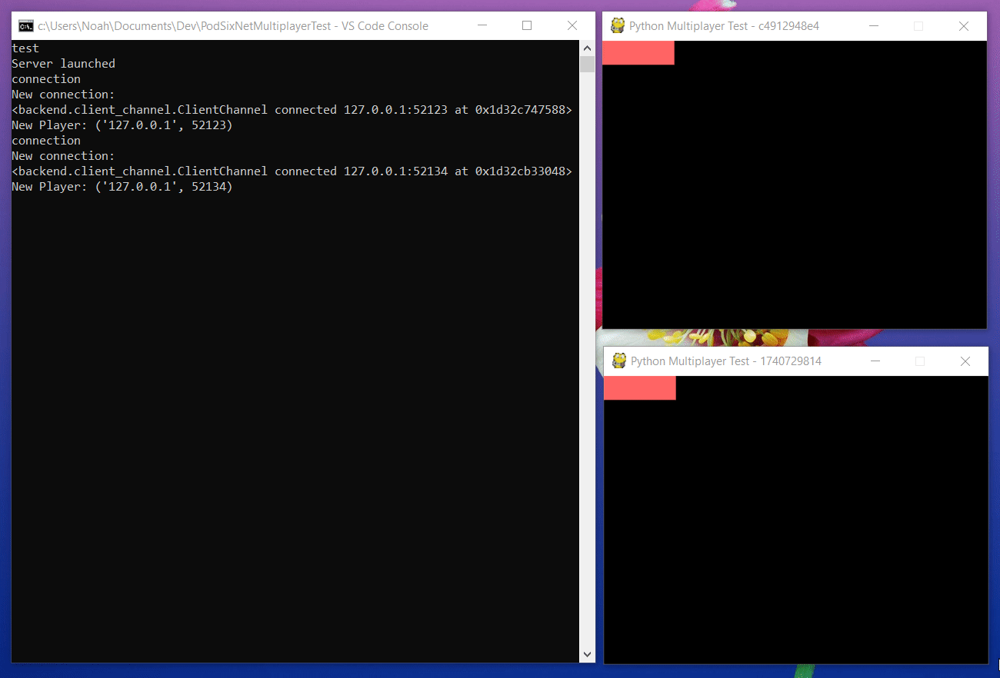

# PythonMultiplayerTest

👪🕹️ Testing basic python multiplayer functionality with PodSixNet for Pygame

**Disclaimer**: This project was built to test TCP utilization for basic multiplayer games. I decided to use PodSixNet because of it's ease. If you check out the demo gif below, there is a delay of a few hundred milliseconds between clients. I would not recommend this for real time multiplayer games. Instead, here is a [multiplayer UDP demo](https://github.com/NoahBres/PythonMultiplayer) which has very minimal lag. However, if you do not need hyper-real time updates, I wholly recommend PodSixNet

## Pre-req

Must have `Python 3+`
This project does not utilize any Python 3 specific features like async so it should be rather simple to backport to Python 2 if you want to.

**Recommended**:
Install [pipenv](https://github.com/pypa/pipenv).
Project comes with a Pipfile. Simply run `pipenv install` to install dependencies and set up a virtualenv.

If you wish to use something like `virtualenv` and `pip` on it's own, feel free. Only dependency is `pygame` for display purposes.

## How to run

`git clone https://github.com/NoahBres/PodSixNetMultiplayerTest`

**If you're using VSCode**:
Project comes with a .vscode `launch.json` so check those out. Simply select a debug profile.
`Server` launches the server. `Client 1` and `Client 2` each run identical clients. `Server/Client` launches `Server` and `Client 1`. `Server/Client/Client` launches `Server`, `Client 1`, and `Client 2`.

**Otherwise**:

_To launch server_:

1.  Navigate to `PythonMultiplayer/PythonMultiplayer/backend`
2.  run `python -m backend`

_To launch client_:

1.  Navigate to `PythonMultiplayer/PythonMultiplayer/client`
2.  run `python -m`

## Demo

## Informal source explanation

`client` - contains client code
`backend` - contains server code

`backend/backend.py` - Runs server code
`backend/client_channel.py` - Spawns a TCP channel for each connection

`client/client.py` - Runs a TCP conneciton to the server
`client/game.py` - Runs the frontend game
`client/player.py` - Player class
`client/network_entity.py` - Network player class
